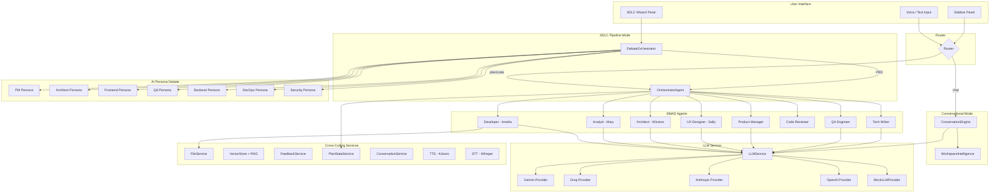

# Verno — AI-Powered SDLC Automation Engine for VS Code

> **Voice-first, multi-agent AI assistant that automates the full Software Development Life Cycle inside VS Code.**

[](./package.json)
[](https://code.visualstudio.com/)
[](./LICENSE)
[](https://github.com/maybeanns/Verno/actions)

---

## Architecture



---

## 9-Phase SDLC Pipeline

Verno maps the complete Software Development Life Cycle to autonomous AI agents:

| # | SDLC Phase | Verno Agent / Service | Key Output |
|---|------------|----------------------|------------|
| 1 | **Requirements** | DebateOrchestrator → PRD Generator | `PRD.md` with OWASP checklist, GDPR/HIPAA flags |
| 2 | **Planning & Estimation** | PlanningAgent + EstimationAgent | Sprint plan, Fibonacci estimates, dependency graph |
| 3 | **Architecture & Design** | ArchitectAgent + UXDesignerAgent | `ARCHITECTURE.md`, tech stack, UX wireframes |
| 4 | **Implementation** | DeveloperAgent (self-healing) | Generated code with compile→fix→retry loop |
| 5 | **Testing & QA** | QAEngineerAgent + TestGeneratorAgent | Test suites, coverage reports |
| 6 | **CI/CD & Deployment** | GitHub Integration Service | Actions workflows, Dockerfiles, K8s manifests |
| 7 | **Monitoring** | OTel + Grafana + Runbook Services | OpenTelemetry hooks, dashboard JSON, ops runbook |
| 8 | **Security** | OWASP Generator + Secret Scanner | Compliance checklists, pre-commit hook |
| 9 | **Documentation** | ReadmeSyncService + ChangelogGenerator | Auto-synced README, CHANGELOG.md, JSDoc |

---

## Key Features

### 🎙️ Voice-First Interface
- **Kokoro TTS** — AI speaks responses aloud with configurable voice and speed
- **Whisper STT** — Hybrid local/cloud transcription with audio sanitization
- **Audio Router** — Auto-selects fastest transcription path

### 🤖 AI Persona Debates
- **7 AI personas** (PM, Architect, Frontend, QA, Backend, DevOps, Security) debate your idea over 3 rounds
- **Security Persona** catches OWASP and compliance issues at requirements stage
- Synthesis produces a structured **Product Requirements Document (PRD)**

### 🔄 Self-Healing Code Generation
- DeveloperAgent generates code, then runs a 4-step quality pipeline:
  1. `npm install` → 2. `tsc --noEmit` → 3. `npm test` → 4. `npm run lint`
- On failure, errors feed back to the LLM for automatic fix (up to 3 retries)
- ConflictResolverAgent merges competing agent edits via semantic merge

### 💬 Streaming Markdown Chat
- Real-time token streaming with `marked.js` + `highlight.js`
- Syntax-highlighted code blocks, lists, bold, and inline code
- Provider/model selection dropdown with `localStorage` persistence

### 🏗️ CI/CD Scaffold Generation
- Detects repo stack and generates GitHub Actions workflow
- Produces `Dockerfile`, `docker-compose.yml`, and Kubernetes manifests
- Sprint auto-planner distributes tasks by team capacity

### 📊 Monitoring & Observability
- Generates OpenTelemetry instrumentation hooks per service
- Produces Grafana dashboard JSON with pre-wired panels
- Auto-generates operational runbooks from architecture context

### 🔒 Security & Compliance
- OWASP Top 10 checklist generated per PRD feature
- GDPR/HIPAA auto-flagging for sections with PII or health data
- Pre-commit secret scanner with git hook injection

### 📝 Documentation Automation
- **README Auto-Sync** — detects stale sections on file save, offers to regenerate
- **Changelog Generator** — parses Conventional Commits into `CHANGELOG.md`
- **JSDoc Generator** — auto-documents exported functions in BMAD-generated files

### 🧪 Test Infrastructure
- `MockLLMProvider` for deterministic agent testing without API calls
- Unit tests for DeveloperAgent, OrchestratorAgent, ConversationEngine
- GitHub Actions CI: lint → compile → test on every push

---

## Installation

### From VSIX (Recommended for FYP Evaluation)
```bash
code --install-extension verno-1.0.0.vsix
```

### From Source
```bash
git clone https://github.com/maybeanns/Verno.git
cd Verno
npm ci
npm run compile
# Press F5 in VS Code to launch Extension Development Host
```

---

## Configuration

All settings are under the `verno.*` namespace in VS Code Settings:

| Setting | Default | Description |
|---------|---------|-------------|
| `verno.defaultProvider` | `gemini` | LLM provider: `gemini`, `groq`, `anthropic`, `openai` |
| `verno.ttsEnabled` | `true` | Enable spoken responses |
| `verno.ttsVoice` | `af_heart` | Kokoro voice model |
| `verno.ttsSpeed` | `1.1` | TTS playback speed multiplier |
| `verno.whisperMode` | `hybrid` | `hybrid`, `local-only`, `cloud-only` |
| `verno.localWhisperModel` | `base` | Local Whisper model: `tiny`, `base`, `small`, `medium`, `large-v3` |

API keys are stored securely via **VS Code SecretStorage** — never in plaintext settings.

---

## Commands

| Command | Shortcut | Description |
|---------|----------|-------------|
| `Verno: Process User Input` | `Ctrl+Shift+;` | Open text input prompt |
| `Verno: Start Recording` | `Ctrl+Shift+R` | Begin voice recording |
| `Verno: Start SDLC Pipeline` | `Ctrl+Shift+L` | Launch debate → PRD → code pipeline |
| `Verno: Toggle Chat / SDLC Mode` | `Ctrl+Shift+M` | Switch between modes |
| `Verno: Show Verno Output` | — | View extension logs |
| `Verno: New Conversation` | — | Clear conversation history |
| `Verno: Clear Stored API Keys` | — | Manage provider API keys |
| `Verno: Generate Code` | — | Direct code generation |
| `Verno: Show Diff` | — | View generated changes |
| `Verno: Manage Agents` | — | Configure agent settings |
| `Verno: Generate Observability Artifacts` | — | OTel + Grafana + Runbook |
| `Verno: Generate OWASP Checklist` | — | Security compliance per PRD |
| `Verno: Check PRD Compliance` | — | GDPR/HIPAA flagging |
| `Verno: Scan for Secrets` | — | Manual secret scan |
| `Verno: Install Pre-Commit Secret Scanner` | — | Git hook injection |
| `Verno: Generate JSDoc` | — | Document BMAD agent exports |
| `Verno: Generate Changelog` | — | CHANGELOG.md from git history |

---

## Project Structure

```
workspace/
└── .verno/
    ├── conversations/       # Conversation history
    ├── todos/               # TODO lists by agent
    ├── feedback/            # Agent feedback reports
    ├── plan-state/          # Persisted plan state + history
    ├── PRD.md               # Product Requirements Document
    ├── ARCHITECTURE.md      # System architecture
    ├── IMPLEMENTATION.md    # Generated code reference
    ├── QA_PLAN.md           # Test plans
    └── CHANGELOG.md         # Auto-generated changelog
```

---

## Requirements

- **VS Code** 1.80.0 or higher
- **Node.js** 18 or higher
- **API key** for at least one LLM provider (Gemini, Groq, Anthropic, or OpenAI)

---

## Release Notes

### 1.0.0 — Full SDLC Automation Engine

**14-phase milestone delivering a complete AI-powered development lifecycle:**

- ✅ Secure credential storage via VS Code SecretStorage
- ✅ SDLC-aware conversational engine with workspace intelligence
- ✅ 7-agent AI debate system with Security persona
- ✅ Hardened PRD generation with ambiguity detection and versioning
- ✅ Sprint auto-planner with Fibonacci estimation and dependency graphs
- ✅ Architecture + UX design generation
- ✅ Self-healing code generation with compile→fix→retry loop
- ✅ Test generation with coverage tracking
- ✅ CI/CD scaffold (GitHub Actions, Docker, K8s)
- ✅ OpenTelemetry + Grafana + Runbook generation
- ✅ OWASP compliance + GDPR/HIPAA flagging
- ✅ Pre-commit secret scanner
- ✅ README auto-sync + Changelog + JSDoc generation
- ✅ Multi-provider LLM streaming with markdown rendering
- ✅ Agent unit tests with MockLLMProvider + GitHub Actions CI
- ✅ Onboarding wizard, keyboard shortcuts, mode toggle
- ✅ Final VSIX package for distribution

### 0.2.0
- Automatic code quality validation in DeveloperAgent
- Feedback system across all BMAD agents
- Real-time progress tracking
- Enhanced sidebar with TODOs, Feedback, Conversations

### 0.0.1
- Initial release with voice recording and agent orchestration

---

## Contributing

See [CONTRIBUTING.md](./CONTRIBUTING.md) for development setup, testing, and PR guidelines.

## License

See [LICENSE](./LICENSE) file for details.

---

**Verno — where AI agents work together to build better software, faster.** 🚀
